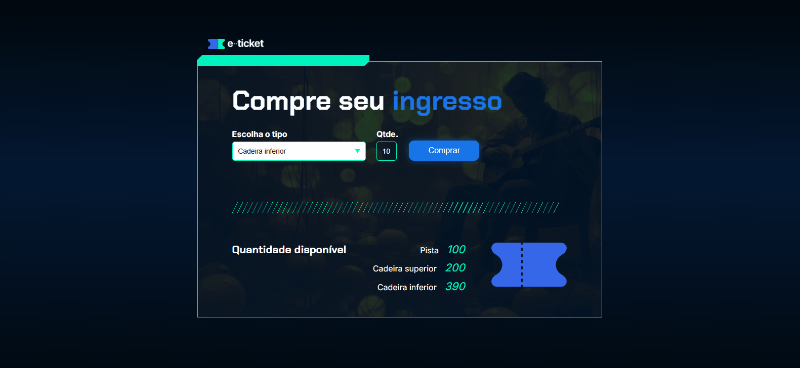

# 🎟️ Verificador de Ingressos

Este projeto foi desenvolvido durante o **Curso de Lógica de Programação da Alura**. O HTML e o CSS foram fornecidos prontos e o foco do exercício foi aplicar a lógica de programação com **JavaScript**.

---

## 💡 O que faz?

Neste projeto, o sistema verifica se um ingresso atende às condições corretas para liberar ou não a "venda". As condições são baseadas em:

- Tipo de ingresso
- Valor do ingresso
- Disponibilidade

Se todas as condições forem atendidas, a mensagem exibida será de venda concluída. Caso contrário, a "venda" será negada.

---

## 🧠 Lógica aplicada em JavaScript

- Uso de variáveis (`let`)
- Condicionais `if`, `else if` e `else`
- Comparações de igualdade (`==`)

---

## 🖥️ Tecnologias utilizadas

| Linguagem | Descrição         |
|-----------|-------------------|
| HTML      | Estrutura da página (pré-pronto) |
| CSS       | Estilização da página (pré-pronto) |
| JavaScript | Implementação da lógica de verificação |

---

## 📷 Preview

> 💡 GIF ilustrativo do projeto rodando no navegador.

---

## 📚 Fonte de estudo

Projeto baseado no curso **"Lógica de Programação"** da [Alura](https://www.alura.com.br/).

---

  Feito por <strong>Victor Hugo</strong>

